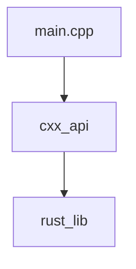

# CXX Rust Integration

This repo is about how you can call Rust code in C++.
[CXX](https://cxx.rs/) generates the needed C++ gluecode for you in a safe way.
For more information, have a look at their website.

## Architecture

The rust part itself consists of two crates in a workspace. One crate, the `rust_lib` is an ordinary library in rust.
It does not know anything about its dependees.  

The `cxx_api` crate takes the `rust_lib` as dependency and build the C++ glue code as a static library.

The C++ executable `main.cpp` consumes the static library
`cxx_api` with its C++ glue code.




## How to build

The build consists of two steps.
1. Building the rust crates: `cargo build (--release)`
2. Build the C++ executable with cmake
    ```sh
    cmake -B <build-dir> . -DCMAKE_BUILD_TYPE=Debug (or Release) 
    cmake --build <build-dir>
    ```
   
## How to run

```sh
cd <build-dir>
./main
```